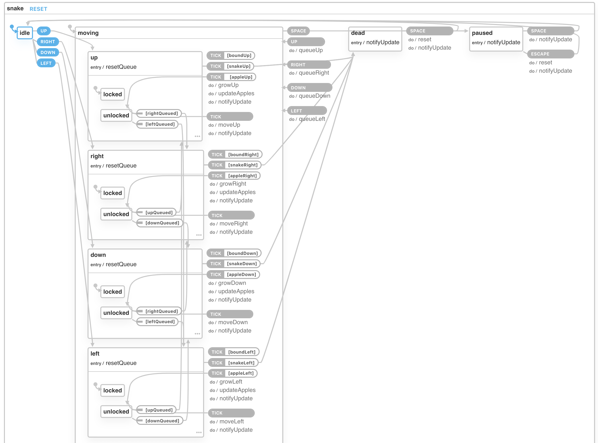

# 🅂🄽🄰🄰🄰🄺🄴

> A snake game driven by [XState](https://xstate.js.org/)

Demo: [snaaake.netlify.app](https://snaaake.netlify.app)

## Why?

**The goal of Snaaake is to implement a game using XState where the driving statechart is agnostic to the implementation details of the game.**

The statechart controls the direction of the snake, but is unaware of how to actually move or grow it (or know when it's supposed to die). Similarly, the statechart isn't concerned with how the bounds, the apples or even the snake itself are defined. To the statechart these are a generic shape. All of this has a couple of advantages:

- It provides a clear separation of concerns. How the snake game looks - or what data structure is used to represent the snake - has little to do with how it works at the foundational level.
- It makes it possible to implement different variations of snake (the game) on top of the same, generic statechart.
- It makes unit testing of the statechart easier since the test data can be simplified.

---

All of the above is of course just for show.

The real reason for Snaaake is to give the author a fun example to practice [XState](https://xstate.js.org/) on. Creating a game is a great opportunity to implement usages of:

- [Context](https://xstate.js.org/docs/guides/context.html) (for extended game state)
- [History](https://xstate.js.org/docs/guides/history.html) (for the pause functionality)
- [Null Events](https://xstate.js.org/docs/guides/events.html#null-events) (to evaluate the game state on "ticks")

## Visualization

https://xstate.js.org/viz/?gist=15582ab43cd031fbb01e62accf5b32ce

